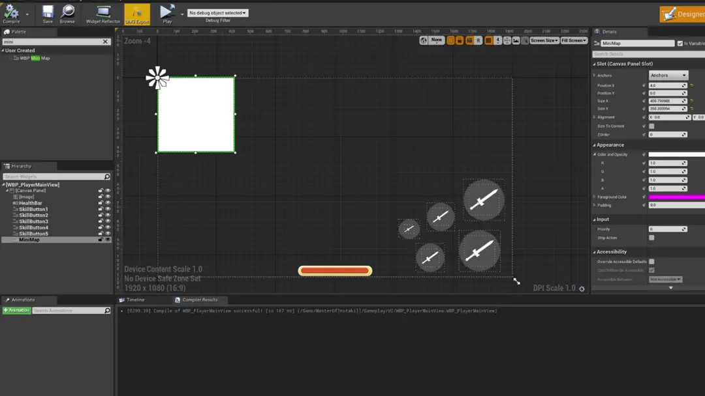

# **[简体中文](README_ZH.md) | English**

This is an Unreal Engine plugin that automatically generates C++ code bindings for UMG blueprint widgets and animations

## Notes

1. Widgets that you want to export to C++ need to have "Is Variable" checked
2. You still need to manually include the header files for the widget classes, but most IDEs provide smart suggestions
   for quick import
3. UMG blueprint files should be named with either "WBP_" or "BP_" as a prefix
4. If a widget is a blueprint type but its parent class ultimately derives from a C++ class, the plugin will keep
   searching up the inheritance chain until it finds a C++ class and insert the necessary binding code, making it easier
   to program
5. Depending on your project directory structure, you may need to adjust the project settings in `Project Settings->
   Plugins->UMGExporter`
    - `ContentSourcePath`: The relative path of UMG blueprint files to this directory will be maintained and generated
      to the `ExportTargetPath` directory below. The default is the `Content` directory, but some project conventions
      may create a directory with the same name as the project under the Content directory, in which case you should set
      this item to that directory
    - `ExportTargetPath`: The relative path for exporting generated files. The default is the `Source/ProjectName`
      directory